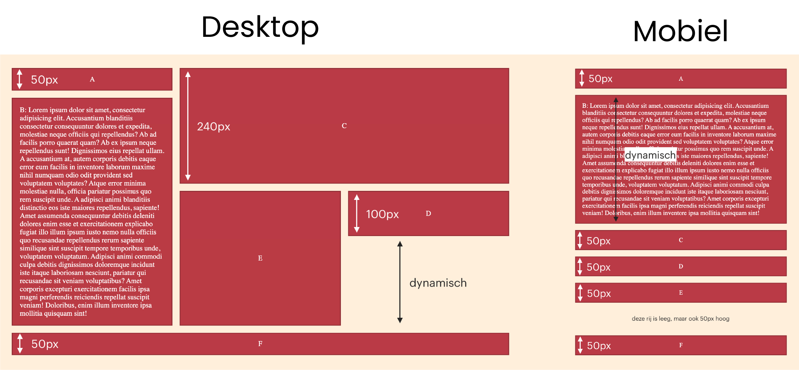

# Opdracht beschrijving

## Eindresultaat
Je gaat een lay-out bouwen met behulp van CSS Grid, die zich op basis van de schermgrootte anders gedraagt:

Je kunt deze opdracht maken door het project te clonen of te downloaden naar jouw eigen computer via [deze](https://github.com/hogeschoolnovi/frontend-css-grid) GitHub repository. De uitwerkingen staan op de branch *uitwerkingen*. Wanneer je liever handmatig een eigen project opzet, mag dit ook.

Het project bevat de volgende bestanden:

- `index.html`: dit bestand is nog leeg, maar bevat één extra meta-viewport tag.
- `styles.css`: dit bestand is nog leeg.

## Randvoorwaarden
* De afstand tussen de elementen is `16px` voor zowel de kolommen als de rijen, op zowel _desktop_ als _mobiel_.
* Gebruik de afmetingen vermeld op het screenshot om de hoogte van de elementen in te stellen. _Let op:_ deze afmetingen stel je in op de grid-declaratie, niet op individuele elementen zelf.
* Alle kolommen in de desktop-grid hebben "dezelfde" breedte en passen zich aan, aan de breedte van het browserscherm.
* De lege gebieden zijn ook daadwerkelijk **leeg**. Je mag hier geen onzichtbare elementen in plaatsen. Wil je weten hoe je omgaat met lege gebieden in een grid? Lees dan het voorbeeld [grid-template-areas](https://css-tricks.com/snippets/css/complete-guide-grid/#aa-grid-template-areas) op CSS Tricks een door om te ontdekken hoe je dit oplost.
* In blok B staan 150 woorden (_tip_: typ `lorem150` in jouw HTML en druk dan op de tabtoets). Dit blok past zich aan op de content die erin staat.

## Stappenplan
Het is uitdagender om jouw eigen stappenplan te maken en te volgen. Weet je even niet waar je moet beginnen? 🤯 Volg dan onderstaande stappen:

1. **Belangrijk:** Leg je PC of laptop even aan de kant en pak er papier en een pen/potlood bij ✏️. Teken bovenstaand plaatje voor _Desktops_ over op papier.
2. Teken de rasterlijnen over de blokken heen.
3. Bedenk hoe breed en hoe hoog elke rij en kolom moet zijn, en schrijf dat in 'grid-termen' in je schets.

Oké, je mag weer aan je laptop komen! 💻

4. Doe even alsof CSS Grid niet bestaat. Maak een simpel container element in `grid-opdracht.html` met daarin de item elementen.
5. Wijs alvast de kleuren toe en zet de letters A - F in de items. Zorg dat de letters netjes in het midden van elk item komen te staan met behulp van flexbox.
6. Tijd om het geraamte neer te zetten. Maak van de container een grid-element en beschrijf de `grid-template-rows` en `grid-template-columns` aan de hand van jouw schets.
7. Geef ieder item een `grid-area` naam
8. Gebruik deze namen om de items aan de grid toe te wijzen met behulp van de `grid-template-areas`
9. Teken nu het plaatje voor _Mobiel_ over op papier. Teken de rasterlijnen over de blokken heen en schrijf de hoogtes en breedtes van de kolommen en rijen erbij.
10. Maak een media-query met een breakpoint minimum waarin je _Desktops_ target. (Dit is geen typefout!)
11. Verplaats nu het gedeelte van de CSS wat specifiek is voor _Desktops_ naar deze media query.
12. Beschrijf buiten de media query een nieuwe grid aan de hand van jouw schets voor _Mobiel_, door de afmetingen van de `grid-template-rows` en `grid-template-columns` te beschrijven.
13. Gebruik de huidige grid-area namen om de items aan de grid toe te wijzen met behulp van de `grid-template-areas`
14. Resize jouw scherm en bekijk jouw CSS Grid in actie!
